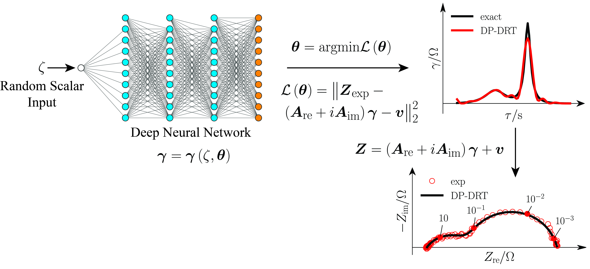

# Project
DP-DRT: Deep Prior Distribution of Relaxation Times

This repository contains the code for one example as shown in the paper "The Deep-Prior Distribution of Relaxation Times" <u>https://iopscience.iop.org/article/10.1149/1945-7111/ab631a/meta</u>.

# Introduction
Electrochemical impedance spectroscopy (EIS) is the established tool for the study of many electrochemical experiments. While the analysis of EIS data is challenging, this can be assisted by the distribution of relaxation time (DRT) method. However, obtaining the DRT is difficult as the underlying problem is ill-posed. Inspired by recent advances in image analysis, we develop a completely new approach, named the deep prior distribution of relaxation time (DP-DRT), for the deconvolution of the EIS to obtain the DRT. The DP-DRT uses a deep neural network fed with a single random input to deconvolve the DRT and fit the EIS data. The DP-DRT has the peculiarity of having a number of parameters much larger than the number of observations. Further, unlike most supervised deep learning models, large datasets are not needed as the DP-DRT is trained against a single available EIS spectrum. The DP-DRT was successfully tested against both synthetic and real experiments displaying considerable promise and opportunities for extensions.


<div align='center'><strong>Figure 1. Schematic illustration of the DP-DRT framework.</strong></div>

# Dependencies
`numpy`

`scipy`
 
`matplotlib`

`pandas`

# Tutorials

* **ex1_simple_ZARC_model.ipynb**: shows how to recover DRT from impedance synthesized using one ZARC element consisting of a resistance placed in parallel to a constant phase element (CPE). The frequency range is from 1E-4 Hz to 1E4 Hz with 10 points per decade (ppd).

* **ex2_double_ZARC_model.ipynb**: shows how the GP-DRT model can manage the overlapping timescales from two ZARC elements in series. The frequency range is from 1E-4 Hz to 1E4 Hz with 10 points per decade (ppd).

* **ex3_truncated_ZARC_model.ipynb**: shows how the GP-DRT model can recover the DRT from the truncated impedance, whose data points at lower frequencies (f < 1E-3 Hz) are not available, and predict the impedance value at these `unmeasured` frequency points.

* **ex4_real_experimental_data.ipynb**: shows an example of real experimental impedance that may represent SOFC. In this tutorial, the impedance data is read from the csv file, and DRT is automatically predicted by the GP-DRT model.

# Citation

```
@article{liu2019gaussian,
  title={The Gaussian process distribution of relaxation times: A machine learning tool for the analysis and prediction of electrochemical impedance spectroscopy data},
  author={Liu, Jiapeng and Ciucci, Francesco},
  journal={Electrochimica Acta},
  pages={135316},
  year={2019},
  publisher={Elsevier}
}
```

# References
1. Ciucci, F. (2018). Modeling electrochemical impedance spectroscopy. Current Opinion in Electrochemistry.132-139 [doi.org/10.1016/j.coelec.2018.12.003](https://doi.org/10.1016/j.coelec.2018.12.003)
2. Wan, T. H., Saccoccio, M., Chen, C., & Ciucci, F. (2015). Influence of the discretization methods on the distribution of relaxation times deconvolution: implementing radial basis functions with DRTtools. Electrochimica Acta, 184, 483-499. [doi.org/10.1016/j.electacta.2015.09.097](https://doi.org/10.1016/j.electacta.2015.09.097)
3. Saccoccio, M., Wan, T. H., Chen, C., & Ciucci, F. (2014). Optimal regularization in distribution of relaxation times applied to electrochemical impedance spectroscopy: ridge and lasso regression methods-a theoretical and experimental study. Electrochimica Acta, 147, 470-482. [doi.org/10.1016/j.electacta.2014.09.058](https://doi.org/10.1016/j.electacta.2014.09.058)
4. Effat, M. B., & Ciucci, F. (2017). Bayesian and hierarchical Bayesian based regularization for deconvolving the distribution of relaxation times from electrochemical impedance spectroscopy data. Electrochimica Acta, 247, 1117-1129. [doi.org/10.1016/j.electacta.2017.07.050](https://doi.org/10.1016/j.electacta.2017.07.050)
5. Ciucci, F., & Chen, C. (2015). Analysis of electrochemical impedance spectroscopy data using the distribution of relaxation times: A Bayesian and hierarchical Bayesian approach. Electrochimica Acta, 167, 439-454. [doi.org/10.1016/j.electacta.2015.03.123](https://doi.org/10.1016/j.electacta.2015.03.123)
6. Liu, J., & Ciucci, F. (2019). The Gaussian process distribution of relaxation times: A machine learning tool for the analysis and prediction of electrochemical impedance spectroscopy data. Electrochimica Acta, 135316. [doi.org/10.1016/j.electacta.2019.135316](https://doi.org/10.1016/j.electacta.2019.135316)
